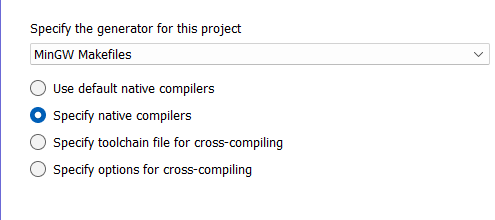

# Image-Enhancement-In-Parallel

Distributed System and Parallel Computing Course Assignment, which required to use CUDA and OpenMP to compare the code performance between Serial, Parallel in CPU and Parallel in GPU

- Image Enhancement with using Gaussian High Pass Filter
- Transfer Image from Spatial domain to Frequency Domain with using Fast-Fourier Transform ( FFT )

# Requirements

For Python :

- Python : v3.12.8
- Port 8888 must be free else will need to insert token

For C++ :

- OpenCV for C++ : v4.10.0
  - [Installation Step for OpenCV C++](#opencv-installation-step)
- MinGW : v14.2.0-rt_v12-rev0
  - [Installation Step for MinGW](#mingw-install)
- NVIDIA GPU
- Visual Studio 2022
  - [Download Visual Studio 2022](https://visualstudio.microsoft.com/vs/)

> **NOTE** : <br>
> OpenCV for C++ will required 2 version, one is compatible with MinGW another is for NVIDIA and Microsoft Visual Studio 2022 to execute

# Test Run Image Enhancement using OpenMP or CUDA

## 1. Decide which platform to test run on

You can choose to test run on either OpenMP or CUDA.

### Option A: OpenMP

Open the `OMP-ImageEnhancementWithGaussianHPFilter.sln` located at `./OpenMP/OMP-ImageEnhancementWithGaussianHPFilter`

### Option B: CUDA

Open the `CUDA-ImageEnhancementWithGaussianHPFilter.sln` located at `./CUDA/CUDA-ImageEnhancementWithGaussianHPFilter`

## 2. Build the solution

You can build the solution in Visual Studio 2022 by going to the top toolbar and selecting `Build` > `Build Solution` or using the keyboard shortcut `CTRL + SHIFT + B`.

## 3. Run the compiled file

You can run the compiled file using the following steps:

1. `cd` to root directory. e.g.:

   ```bash
   cd path/to/Image-Enhancement-In-Parallel
   ```

2. Run command to execute the test file in command prompt
   ```bash
   path/to/exe_file_to_execute -single [cutoff frequency] [alpha] path/to/image_file
   ```
3. Check results

   ### Option A: OpenMP

   You can see the result in the `./resource/result/OpenMP` folder

   ### Option B: CUDA

   You can see the result in the `./resource/result/CUDA` folder

> **NOTE** : <br>
> If you want to only look at the RGB output, look for the file name

# Project Setup and Usage Guide For Seeing the Performance Comparison between Serial, OMP, and CUDA

This part provides step-by-step instructions for setting up a Python environment, installing the required dependencies, and running the project's main script.

## 1. Create and Activate a Python Environment

You can choose to use either a virtual environment (`venv`) or Conda.

### Option A: Virtualenv / venv

1. Create a new environment with Python 3.12.8:

   ```bash
   python -m venv myenv
   ```

2. Activate the environment:

   - On Windows:
     ```cmd
     myenv\Scripts\activate
     ```

3. Install dependencies:
   ```bash
   pip install -r requirements.txt
   ```

### Option B: Conda

1. Create a new environment with Python 3.12.8:

   ```bash
   conda create --name myenv python=3.12.8
   ```

2. Activate the environment:

   ```bash
   conda activate myenv
   ```

3. Install dependencies:
   ```bash
   pip install -r requirements.txt
   ```

## 2. Navigate to the Project Directory

Clone this repository:

```bash
git clone https://github.com/crabbbb/Image-Enhancement-In-Parallel.git
```

Change into the project directory:

```bash
cd path/to/project/Image-Enhancement-In-Parallel
```

## 3. Run the Script

Once the environment is activated and dependencies are installed, run the script:

```bash
python main.py
```

## 4. Deactivating the Environment (Optional)

- **venv**:

  ```bash
  deactivate
  ```

- **Conda**:
  ```bash
  conda deactivate
  ```

---

## Troubleshooting

- Ensure that you are using **Python 3.12.8**.
- Double-check that the `requirements.txt` file is in the project directory before installing dependencies.
- If you encounter permission issues on Unix-based systems, you may need to adjust file permissions (e.g., `chmod +x`) or use `sudo` cautiously (though it is not recommended for Python environments).

# OpenCV Installation Step

1. Download OpenCV Window .exe file [[OpenCV release page]](https://github.com/opencv/opencv/releases/tag/4.10.0)<br/>
   
2. Execute .exe extract the opencv folder to <code><b> C:\ </b></code>
3. Window open edit the system environment variable > Environment Variable > Advannced > Under System Variable find Path > Double Click > Add a new Path <code> C:\opencv\build\x64\vc16\bin </code> > Click OK and close the app
4. At Visual Studio 2022, Right Click Project > Properties
   - C/C++ > General > Additional Include Directories > Enter <code> C:\opencv\build\include </code>
   - Linker > General > Additional Library Directories > Enter <code> C:\opencv\build\x64\vc16\lib </code>
   - Linker > Input > Additional Dependencies > Enter <code> opencv_world4100d.lib;opencv_world4100.lib; </code>
     - \*d.lib is for debug purpose
     - .lib is for release use
5. Execute the code below, console should be able to prompt the "Hello World!"

   ```python
   #include <opencv2/opencv.hpp>
   #include <iostream>

   int main()
   {
       std::string image_path = "C:\\path-to-your-resource\\resource\\raw\\lena.jpeg";
       cv::Mat rgb_image = cv::imread(image_path, cv::IMREAD_COLOR);
       cv::imshow("RGB Image", rgb_image);
       // must put, else will have error
       cv::waitKey(0);
   }
   ```

6. If Debug facing the error below, restart the Visual Studio 2022 <br/>
   

# MinGW Install

1. Download MinGW [[MinGW release page]](https://github.com/niXman/mingw-builds-binaries/releases)
   - version : x86_64-14.2.0-release-posix-seh-ucrt-rt_v12-rev0.7z <br>
     
2. Add <code> C:\mingw64\bin</code> into SYSTEM path
3. Extract zip folder, put mingw64 folder under <code> C:\ </code>
4. Download CMake and OpenCV source code
   - CMake : [[CMake Download Link]](https://cmake.org/download/)
     - Remember to select the option add CMake into SYSTEM path, else need to enter mannually <code> C:\Program Files\CMake\bin </code>
   - OpenCV 4.10.0 source code : [[OpenCV release page]](https://github.com/opencv/opencv/releases)
5. Extract zip folder of OpenCV source code to any location
6. Generate compatable version of OpenCV that can work with MinGW using CMake
   - Open CMake, Select the path to OpenCV source code folder and the output location must be under <code> C:\opencv-mingw </code> <br>
     
   - Click Configure, Select the option below <br>
     
   - Click Next, Enter the path to gcc.exe and g++.exe so that CMake able to use them to compile <br>
     
   - Click Finish CMake will start working, after configure finish running, Click Generate <br>
     
7. Open Command prompt run the command below
   ```bash
   mingw32-make
   mingw32-make install
   ```
